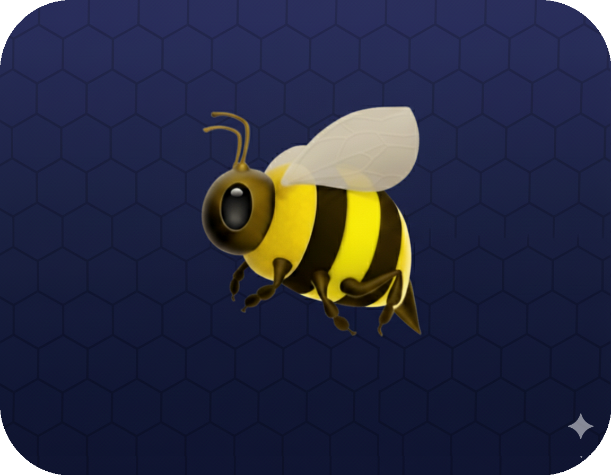
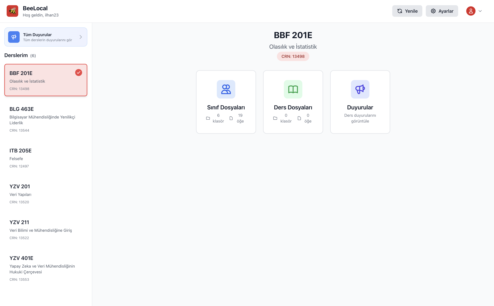
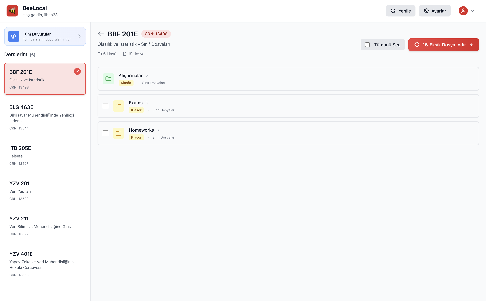

# 🐝 BeeLocal - Ninova Dosya Senkronizasyon Uygulaması

İTÜ Ninova platformu için geliştirilmiş modern bir desktop uygulaması. Ders dosyalarınızı kolayca takip edin, yönetin ve indirin.

<div align="center">
  
  
  [](LICENSE)
  [](CHANGELOG.md)
  []()
  [](https://yusufalperilhan.github.io/BeeLocal)
  
  [🇹🇷 Türkçe](README.md) • [🇬🇧 English](README_EN.md)
</div>

## 📖 Ninova Nedir?

**Ninova**, İstanbul Teknik Üniversitesi (İTÜ) tarafından geliştirilmiş e-öğrenme platformudur. Öğrenciler ve eğitmenler için elektronik ortamda öğretme ve öğrenme imkânı sunar. Platform üzerinden:

- 📚 Ders materyalleri (ders notları, sunumlar, PDF'ler)
- 📎 Ders dosyaları ve ekler
- 📢 Duyurular ve haberler
- 📝 Ödevler ve projeler
- 📊 Ders içerikleri ve kaynaklar

paylaşılır ve yönetilir.

**BeeLocal**, Ninova platformundaki ders dosyalarınızı otomatik olarak takip eder, yeni dosyaları bildirir ve kolayca indirmenizi sağlar. Artık her dosyayı manuel olarak kontrol etmenize gerek yok!

## ✨ Özellikler

### 🔐 Güvenlik
- **Şifreli Depolama**: Giriş bilgileriniz Electron'un safeStorage API'si ile güvenle şifrelenir
- **Beni Hatırla**: Bir kez giriş yapın, bir daha şifre girmeye gerek yok
- **Local Veri**: Tüm verileriniz cihazınızda saklanır, hiçbir veri dışarıya gönderilmez

### 📚 Ders Yönetimi
- Tüm derslerinizi tek bir yerden görüntüleyin
- Derslere kolay erişim için düzenli liste
- Dönem ve ders kodu bilgileri
- Hızlı arama ve filtreleme

### 📥 Akıllı Dosya Takibi
- Hangi dosyaların indirildiğini/indirilmediğini görün
- İndirilmiş dosyalar yeşil, yeni dosyalar mavi renkle işaretlenir
- Dosya boyutu ve yüklenme tarihini görün
- SQLite database ile güvenilir kayıt tutma

### ⚡ Esnek İndirme Seçenekleri
- **Tek Dosya**: Bir dosyayı hızlıca indirin
- **Çoklu Seçim**: İstediğiniz dosyaları seçip toplu indirin
- **Tümünü İndir**: Tüm yeni dosyaları tek tıkla indirin
- **Progress Tracking**: İndirme ilerlemesini gerçek zamanlı takip edin

### 🎨 Modern Arayüz
- Sezgisel ve kullanıcı dostu tasarım
- Responsive layout (her ekran boyutuna uyumlu)
- Material Design ilkelerine uygun
- Smooth animasyonlar ve geçişler

### 🌙 Tema Desteği
- **Light Mode**: Gündüz kullanımı için aydınlık tema
- **Dark Mode**: Göz yormayan koyu tema
- **Sistem Teması**: İşletim sisteminizin temasını otomatik takip edin

### ⚙️ Özelleştirilebilir Ayarlar
- **Klasör Yapısı Seçimi**:
  - Ders Adı: `İndirilenler/[Ders Adı]/[Dosya]`
  - Dönem/Ders: `İndirilenler/[Dönem]/[Ders]/[Dosya]`
  - Özel: Kendi yapınızı belirleyin
- **Bildirimler**: İndirme tamamlandığında bildirim alın
- **İndirme Klasörü**: İstediğiniz klasörü seçin

## 📋 Kurulum

### Sistem Gereksinimleri

- **macOS**: 10.13 (High Sierra) veya üzeri
- **Windows**: Windows 10 veya üzeri
- **Linux**: Ubuntu 18.04 veya eşdeğeri
- **RAM**: Minimum 4GB (8GB önerilir)
- **Disk**: En az 500MB boş alan

### Hızlı Başlangıç

#### Hazır Kurulum Dosyaları (Önerilen)

1. [Releases](https://github.com/YusufAlper17/BeeLocal/releases) sayfasından platformunuza uygun dosyayı indirin:
   - **macOS (Apple Silicon)**: `BeeLocal-1.0.0-arm64.dmg`
   - **macOS (Intel)**: `BeeLocal-1.0.0-x64.dmg`
   - **Windows (Kurulum)**: `BeeLocal-Setup-1.0.0-win-x64.exe`
   - **Windows (Taşınabilir)**: `BeeLocal-Portable-1.0.0-win-x64.exe`
   - **Linux (AppImage)**: `BeeLocal-1.0.0-linux-x64.AppImage`
   - **Linux (Debian)**: `BeeLocal-1.0.0-linux-x64.deb`

2. İndirdiğiniz dosyayı çalıştırın ve kurulum adımlarını takip edin

#### Kaynak Koddan Derleme

```bash
# Repository'yi klonlayın
git clone https://github.com/yusufalperilhan/BeeLocal.git
cd BeeLocal

# Bağımlılıkları yükleyin
npm install

# Geliştirme modunda çalıştırın
npm run electron:dev

# Production build oluşturun
npm run electron:build
```

Detaylı kurulum talimatları için [KURULUM.md](KURULUM.md) dosyasına bakın.

## 🚀 Kullanım

### 1. İlk Giriş

- Uygulamayı açın
- İTÜ kullanıcı adı ve şifrenizi girin
- "Beni Hatırla" seçeneğini işaretleyerek otomatik giriş aktif edin
- "Giriş Yap" butonuna tıklayın

### 2. Ana Ekran (Dashboard)



Ana ekranda:
- **Sol Panel**: Derslerinizin listesi ve "Tüm Duyurular" butonu
- **Sağ Panel**: Seçili dersin detayları (Sınıf Dosyaları, Ders Dosyaları, Duyurular)
- **Üst Bar**: Yenile, Ayarlar ve Çıkış butonları

### 3. Dosya Yönetimi



Dosya yönetimi ekranında:
- Seçili dersin klasör ve dosyalarını görüntüleyin
- İndirilmemiş dosyaları görün (eksik dosya sayısı gösterilir)
- "Tümünü Seç" ile tüm dosyaları seçin
- "Eksik Dosya İndir" butonu ile eksik dosyaları toplu indirin
- Klasörlere tıklayarak içeriğini görüntüleyin

## 🛠️ Teknoloji Stack

| Kategori | Teknoloji | Versiyon |
|----------|-----------|----------|
| Desktop Framework | Electron | 28.0.0 |
| UI Framework | React | 18.2.0 |
| Type Safety | TypeScript | 5.2.2 |
| Styling | Tailwind CSS | 3.3.6 |
| State Management | Zustand | 4.4.7 |
| Web Scraping | Puppeteer | 23.11.1 |
| Database | SQL.js | 1.10.3 |
| Build Tool | Vite | 5.0.8 |

## 📁 Proje Yapısı

```
BeeLocal/
├── electron/              # Electron ana süreç
│   ├── main.ts           # Uygulama entry point
│   ├── preload.ts        # IPC bridge
│   └── services/         # Backend servisler
│       ├── ninova.ts     # Ninova scraper
│       ├── database.ts   # SQLite yönetimi
│       ├── storage.ts    # Güvenli depolama
│       └── download.ts   # Dosya indirme
├── src/                  # React frontend
│   ├── components/       # UI bileşenleri
│   ├── pages/           # Sayfa component'leri
│   ├── store/           # Zustand state stores
│   ├── types/           # TypeScript tipleri
│   ├── hooks/           # Custom React hooks
│   └── utils/           # Yardımcı fonksiyonlar
├── assets/              # İkonlar ve görseller
└── public/              # Statik dosyalar
```

## 🌐 Web Sitesi (GitHub Pages)

BeeLocal'in resmi web sitesi GitHub Pages üzerinden yayınlanmaktadır: [yusufalperilhan.github.io/BeeLocal](https://yusufalperilhan.github.io/BeeLocal)

Web sitesinde uygulama özellikleri, ekran görüntüleri ve indirme linkleri bulunur.

## 🤝 Katkıda Bulunma

Katkılarınızı bekliyoruz! Projeye katkıda bulunmak için:

1. Bu repository'yi fork edin
2. Feature branch'i oluşturun (`git checkout -b feature/amazing-feature`)
3. Değişikliklerinizi commit edin (`git commit -m 'feat: Add amazing feature'`)
4. Branch'inizi push edin (`git push origin feature/amazing-feature`)
5. Pull Request oluşturun

## 🐛 Hata Bildirimi

Bir hata bulduysanız veya öneriniz varsa [Issues](https://github.com/yusufalperilhan/BeeLocal/issues) sayfasından yeni bir issue açabilirsiniz.

## 📝 Değişiklik Geçmişi

Tüm önemli değişiklikler [CHANGELOG.md](CHANGELOG.md) dosyasında belgelenir.

## 🔒 Gizlilik

BeeLocal, gizliliğinize önem verir:

- ✅ Tüm veriler local olarak saklanır
- ✅ Şifreler güvenli şekilde şifrelenir
- ✅ Hiçbir veri üçüncü parti sunuculara gönderilmez
- ✅ Açık kaynak kodlu - ne yaptığımızı görebilirsiniz

## ⚠️ Yasal Uyarı

Bu uygulama **resmi bir İTÜ uygulaması değildir**. Öğrenciler tarafından, öğrencilerin hayatını kolaylaştırmak için geliştirilmiştir. Uygulamayı kullanarak İTÜ'nün kullanım şartlarına uygun davrandığınızı kabul etmiş olursunuz.

## 📄 Lisans

Bu proje MIT lisansı altında lisanslanmıştır. Detaylar için [LICENSE](LICENSE) dosyasına bakın.

## Teşekkürler

- İTÜ öğrencilerine ilham ve feedback için
- Açık kaynak topluluğuna harika araçlar için
- Katkıda bulunan herkese

---

<div align="center">

  
  [Website](https://yusufalperilhan.github.io/BeeLocal) • [Documentation](docs/) • [Report Bug](https://github.com/yusufalperilhan/BeeLocal/issues) • [Request Feature](https://github.com/yusufalperilhan/BeeLocal/issues)
</div>
